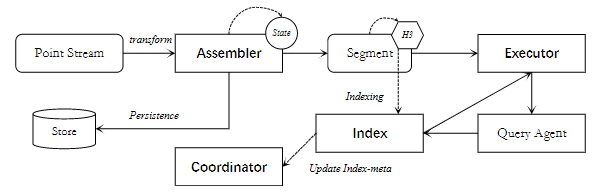

## Overview

Implementation code for our under-review paper **"Misty: Microservice-based Streaming Trajectory Similarity Search"**. 

Misty is a microservice-based real-time processing framework for streaming trajectory similarity search query. The entire framework is developed based on Dapr. As a future direction, we are working on Misty's extension to spatial join and query plan optimization for higher throughput and more elastic index scaling.

## Quick start

```shell
conda env create -f env.yml
conda activate misty
python tests/test.py
```

## Dataset

We use a selected subset of T-Drive dataset presented in `data/filtered` folder. The preprocessing code can be found in
`preprocess.ipynb`

## Module list



| Module name in framework | Folder name                  |
|--------------------------|------------------------------|
| Point Stream | [ingress](./ingress/)         |
| Assembler | [assembler](./assemble/)     |
| Index | [index](./index/)            |
| Coordinator | [coordinator](./index_meta/) |
| Executor | [executor](./compute/)       |
| Qyery Agent | [agent](./agent/)            |


